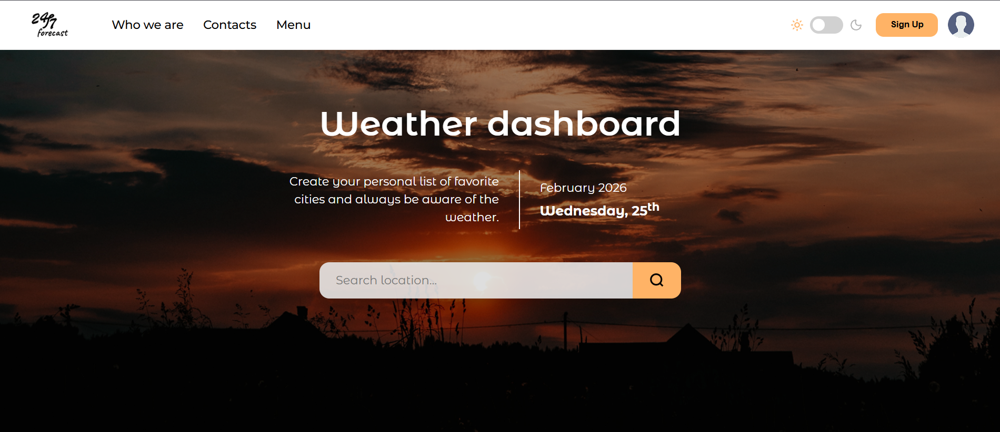
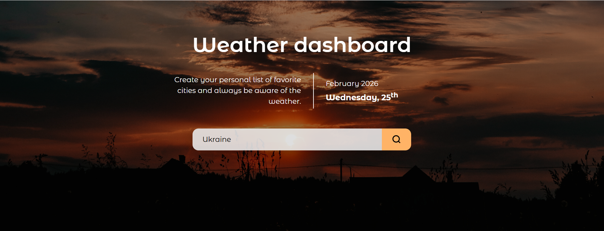
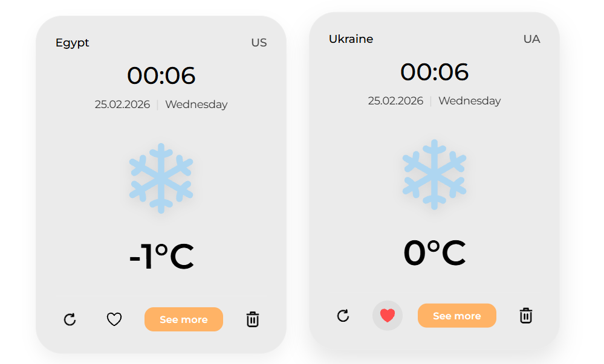
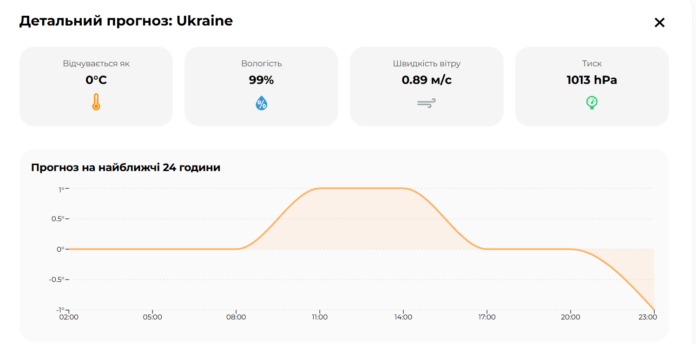
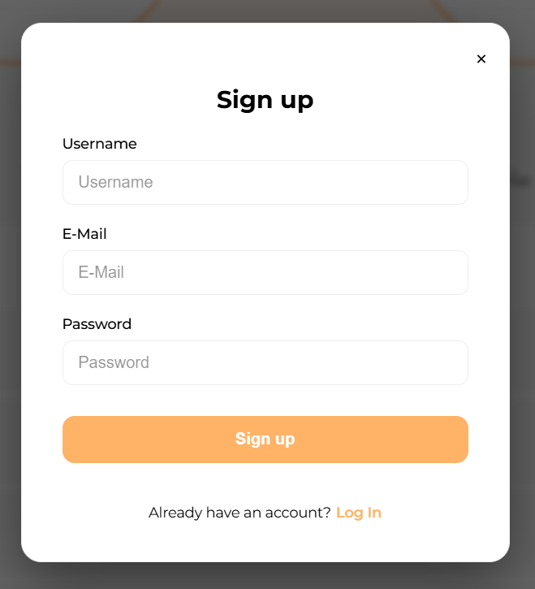
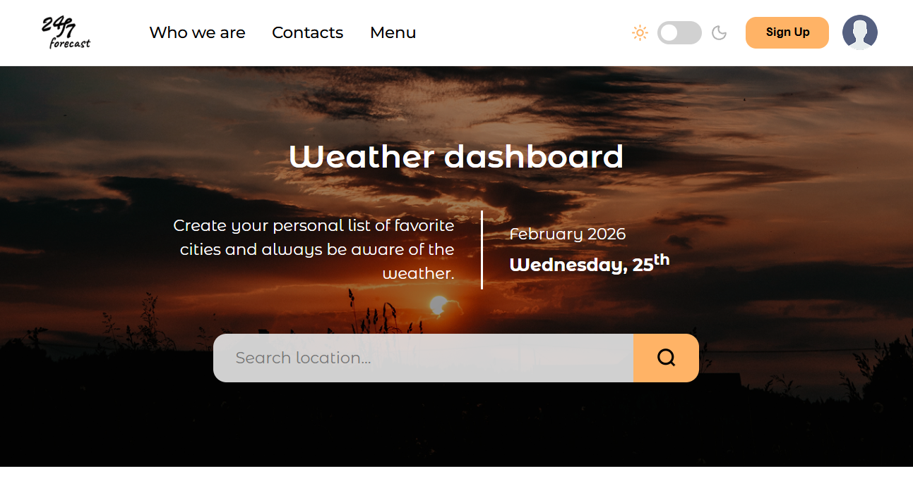
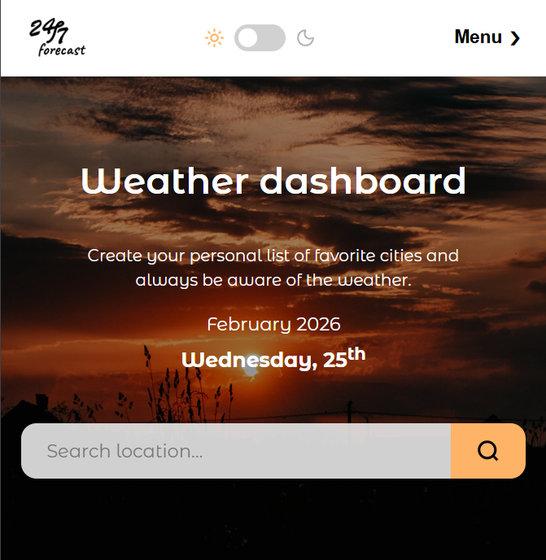
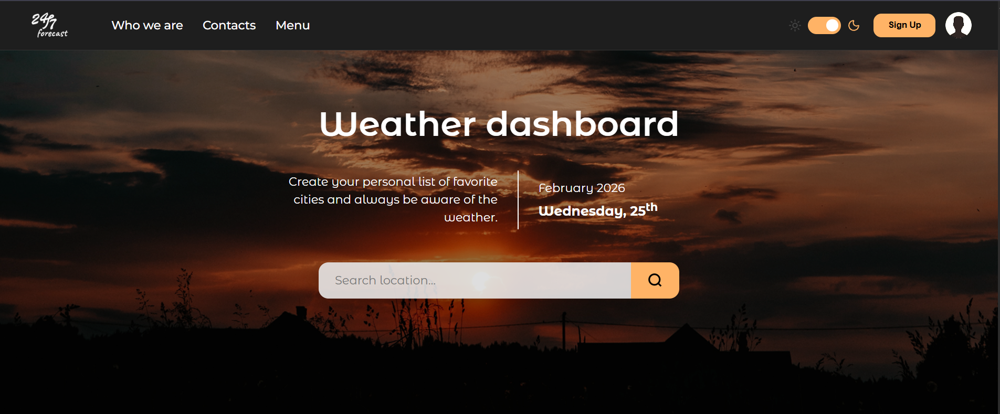

# 24/7 Forecast

Це сучасний веб-додаток для відстеження погоди в реальному часі. Додаток дозволяє користувачам шукати міста, переглядати детальний прогноз та зберігати улюблені локації у власному профілі.

## Посилання

- **Сайт:** [https://www.forecast.com](https://cupheadultra.github.io/weather-dashboard/)

## Опис

24/7 Forecast — це не просто погодний віджет, а персоналізований хаб. Завдяки інтеграції з OpenWeather API, додаток надає точні дані про температуру, вологість та вітер, а вбудована система авторизації дозволяє кожному користувачу мати свій унікальний список міст.

- **Пошук міст**: Миттєве отримання поточної погоди для будь-якої точки світу.

- **Обране**: ористувачі можуть натиснути на "серце", щоб зберегти місто. Ці дані прив'язуються до email користувача та зберігаються локально.
- **Детальний прогноз**: При натисканні на "See more" відкривається розгорнута інформація з графіком або погодинним прогнозом.

## Функціональність сайту
- **Система акаунтів** - Реалізована реєстрація та логін. Кожен користувач бачить лише ті міста, які він сам додав у вибране.

<i>Форма авторизації користувача</i>

- **Адаптивна верстка** - Інтерфейс коректно відображається на десктопах, планшетах та мобільних пристроях.

  
Планшет:

  
Телефон: 

- **Перемикач тем** - Підтримка Світлого та Темного режимів для комфортного перегляду в будь-який час доби.

Темна тема

  &nbsp;
  &nbsp;
  &nbsp;
  &nbsp;
  &nbsp;

**Інструменти**:

    &nbsp;
  &nbsp;
 

## Про автора

Цей веб-сайт був створений Святославом Калугіним [GitHub](https://https://github.com/CupheadUltra)
